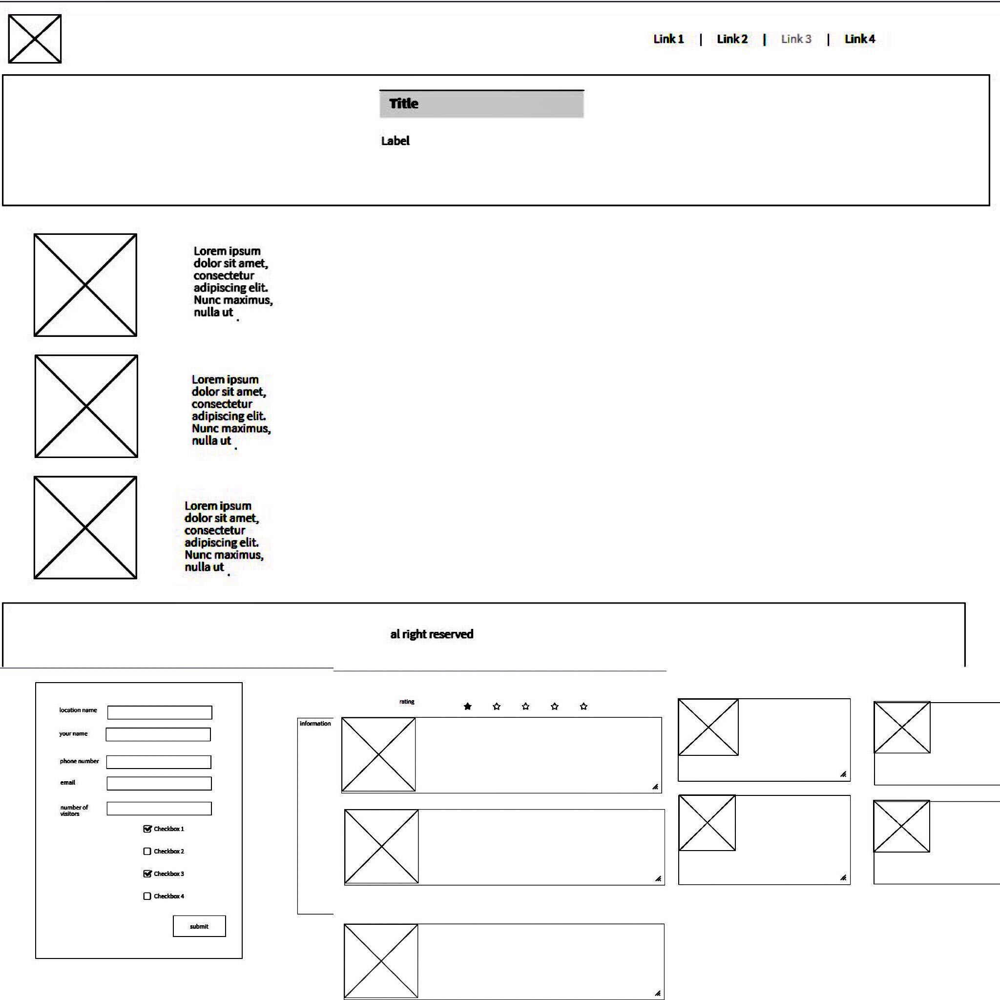
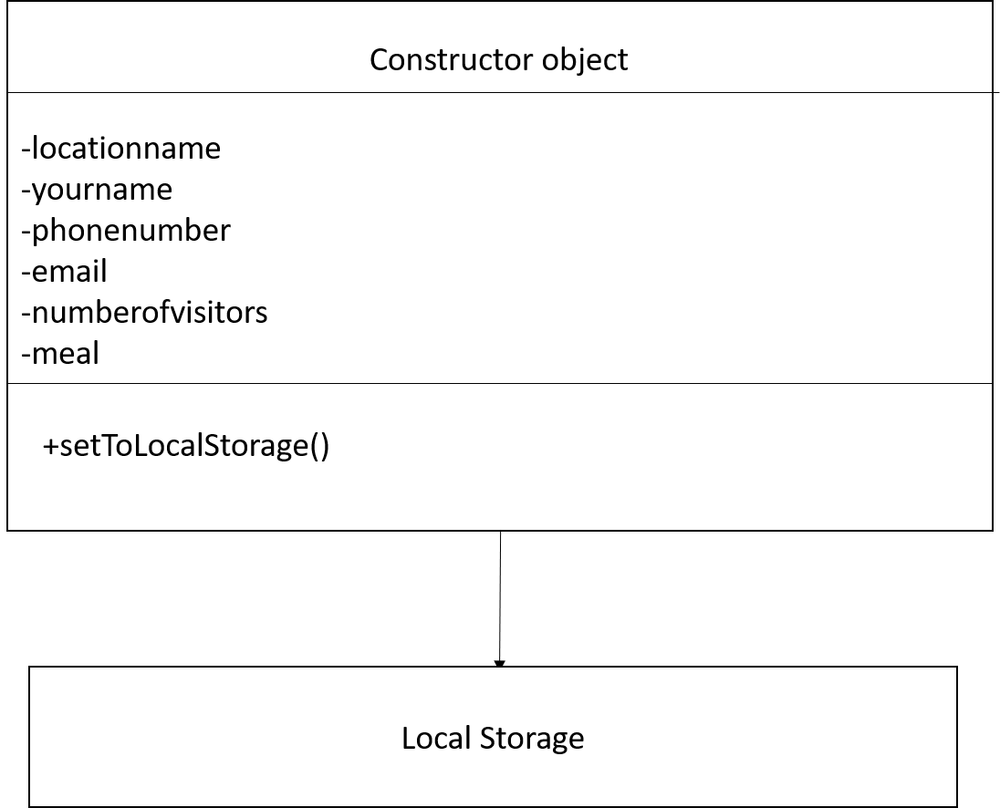

# Adventurous-tours:
# sharpshooters-team members: 
1. Noura Alquran
2. Areen Jaradat.
3. Eman Sawalha.
4. Ibrahim Aburass.
5. Obada Athamneh.
* In the beginning we chose the name of our team as the sharpshooters because we believe we know what we want and we are confident that we will achieve the best results.
# Our project idea :
* The idea of ​​our project is to design a website to book adventure trips in Jordanian locations. What distinguishes our site is that it provides you with unique adventures with your friends or family at the lowest prices.

# WireFrames:

# User Stories :
* As an investor and owner of the project, I am thinking of presenting my product in a way that I guarantee customer satisfaction. As a user , I thought that I wanted to see trip plans, places and prices on the homepage of the site, before going to the reservation page to book an adventure trip.
* As a user I want to see past experiences of previous users and provide my feedback because I think that this will increases the customer’s confidence , increase the popularity of the site and help the admins to improve their services.
* As a user I prefer to have a real booking system and when I book a trip ,I want to see the information and the price of the adventure to review what I entered.
* As an admin, I want when users come to my website to reserve a trip so that website will help them to get a cheaper and interested trip. As a user, I want to search for my trip in good price and high quality.
* As a user I want to find some advice from the trip generator that will help me to make my mind and give me the beast trip available.
# Domain Modeling :

